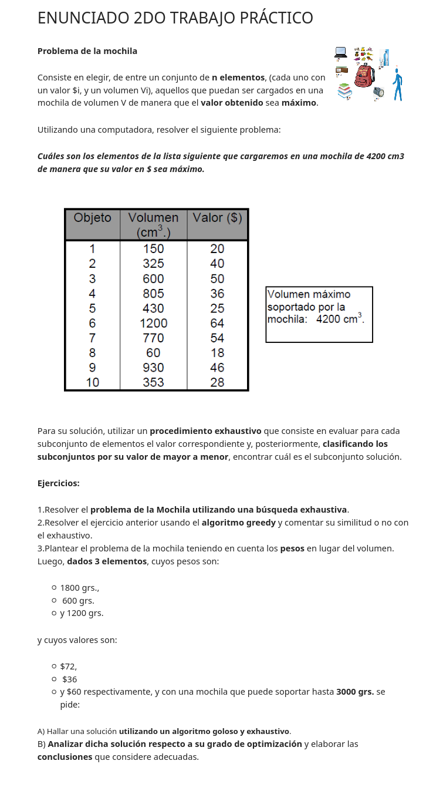

# Trabajo Práctico Nº2

## Enunciado

<h1 align="center">
  
</h1>

## Ejercicios

### Ejercicio 1: Resolver el problema de la mochila utilizando una busqueda exhaustiva

Como es una busqueda exhaustiva, primero se deben generar todas las soluciones.
Luego, se evaluaran todas para encontrar la mejor.

El problema contiene 10 elementos que pueden estar en la mochila o no, por lo que las soluciones van
desde la que no tiene ningun elemento hasta la que tienen todos (1024 soluciones).
Luego, habra que evaluarlas todas, descartar las que no cumplen con la restriccion de volumen y
encontrar la que tiene un mayor valor en las que si cumplen con las restriciones de volumen.

Ejemplo posibles soluciones:

 (Objeto 1, Objeto 2, ... , Objeto 10)

    0 0 0 0 0 0 0 0 0 0
    1 0 0 0 0 0 0 0 0 0
    1 1 0 0 0 0 0 0 0 0
    ...
    ...
    ...
    1 1 1 1 1 1 1 1 1 1
    
Ejercicio 2
    
    ...
    
Ejercicio 3
    
A. 

1) Hallar una solución  utilizando un algoritmo goloso.

El algoritmo goloso construye una solución buscando el máximo beneficio en cada paso del proceso de búsqueda.
En el nuestro caso, el valor de cada elemento en función a su peso es:

- Elemento 1: 72$ / 1800 grs = 0,04
- Elemento 2: 36$ / 600 grs = 0,06
- Elemento 3: 60$ / 1200 grs = 0,05

Luego, se procede a realizar la busqueda de la solución optima:

- Seleccionar elemento 2, cuya relación valor/peso es 0,06.
- Seleccionar elemento 3, cuya relación valor/peso es 0,05. El valor total es 108$ y el peso 2400 grs. No se puede seguir seleccionando elementos ya que supera el peso soportado.

Luego, la solución final es : Valor de 96$ y peso 1800gr.

2) Hallar una solución  utilizando un algoritmo exhaustivo.

...

B. Analizar dicha solución respecto a su grado de optimización y elaborar las conclusiones que considere adecuadas.

La solución a la que se llego utilizando el algoritmo goloso no es la optima, ya que si se seleccionaba el elemento 1 y 3 se consigue un valor de 132$ y un peso de 3000grs que también cumple con las restricciones del peso del problema. Sin embargo, es una buena solución, ya que se acerca al valor optimo

Luego, para mejorar la solución, se utilizo la técnica de búsqueda exhaustiva